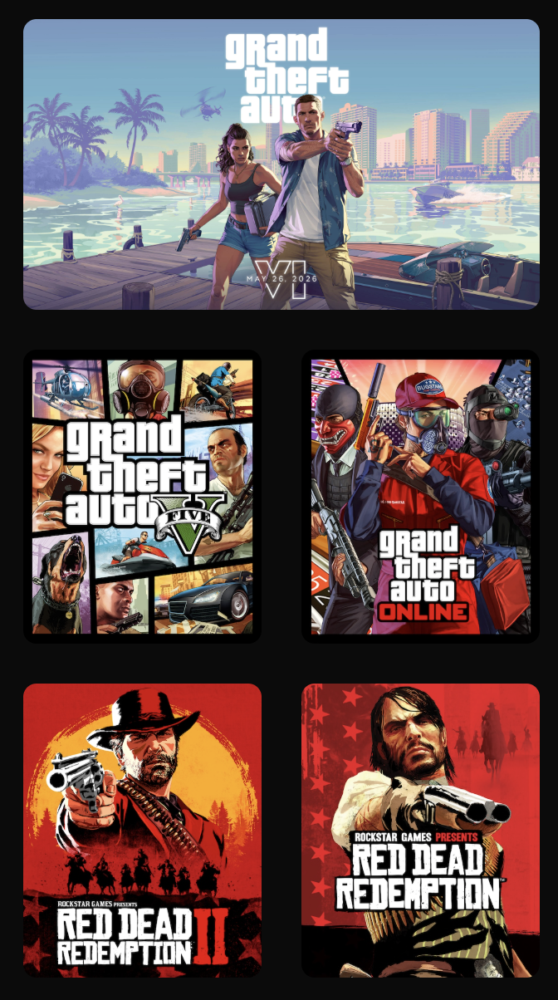

Procesverslag

Markdown is een simpele manier om HTML te schrijven.  
Markdown cheat cheet: [Hulp bij het schrijven van Markdown](https://github.com/adam-p/markdown-here/wiki/Markdown-Cheatsheet).

Nb. De standaardstructuur en de spartaanse opmaak van de README.md zijn helemaal prima. Het gaat om de inhoud van je procesverslag. Besteedt de tijd voor pracht en praal aan je website.

Nb. Door *open* toe te voegen aan een *details* element kun je deze standaard open zetten. Fijn om dat steeds voor de relevante stuk(ken) te doen.

## Jij

  
uitwerken voor kick-off werkgroep

  ### Auteur:
  Amber Baart

  #### Je startniveau:
  Blauw

  #### Je focus:
  Responsive
 

## Je website

  
uitwerken voor kick-off werkgroep

  ### Je opdracht:
  link naar de website die je gaat namaken óf de naam/omschrijving van je eigen ontwerp 
  <a href="https://www.rockstargames.com">website rockstargames</a>

  #### Screenshot(s) van de eerste pagina (small screen): 
  Rockstar Games  
  

  #### Screenshot(s) van de tweede pagina (small screen):
  Grand Theft Auto V  
  
 

## Toegankelijkheidstest 1/2 (week 1)

  
uitwerken na test in 2e werkgroep

  ### Bevindingen
  Lijst met je bevindingen die in de test naar voren kwamen:

  1. Het is belangrijk om echt goed te luisteren naar wat de screen-reader zegt, anders mis je welke knoppen je moet inklikken om verder te gaan naar een ander scherm of op een knop te klikken. Vaak zijn de combinaties van de       toetsen verschillend per interactie.

     

  2. Onderin bij de pagina van Rockstar Games kun je een taal aankiezen. Er is een keuze uit 13 talen voor de pagina. Eenmaal bij taal 13 was het voor mij lastig te begrijpen hoe je uit de tab kon om een taal te kiezen.

     

  3. Je kan de cookies settings niet aanpassen via de screen reader. De screen reader leeft namelijk die link in de footer niet voor en is dus ook niet klikbaar voor mensen die daar afhankelijk van zijn.

     

  4. Bij de categorie links leest de voice-over niet altijd voor dat iets een video is, dus voornamelijk als je blind bent weet je niet dat je mogelijk op een video gaat klikken. Daarnaast begint de video gelijk als je erop         klikt. Dit kan beter aangegeven worden door op te lezen dat het een video is in plaats van simpelweg "link".

     

     
  5. Er is soms een mogelijkheid rechts bovenin om het menu over te slaan en gelijk door te gaan naar de content. Dit is wel fijn voor de gebruiker, alleen zie ik niet altijd wanneer deze optie tevoorschijn komt. Het is voor mij op het moment onduidelijk wanneer deze optie verschijnt.

     

  6. Als ik met de voice-over door de carousel ga, dan laat hij de tekst van de andere pagina's niet zien maar alleen de afbeeldingen. De tekst wordt hierdoor ook niet opgelezen, maar alleen de link binnen de afbeelding. En je zou dus niet goed weten waar het over gaat.

     

  7. De kopjes onder "newswire" worden opgelezen. Het kopje hieronder wordt opeens in een andere taal opgelezen. Dit is niet bepaald handig voor slechtziende mensen.

     

  8. Hij leest de navigatie als banner, wat naar mijn mening niet heel goed geformuleerd is want als je slechtziend bent is het woord "banner" niet heel duidelijk.

     

 9. De voice-over leest goed op wat voor lijst het is. Zoals hier zijn het iconen en dat wordt duidelijk aangetoont bij de voice-over.

     

10. Wanneer je bij de footer bent, wordt dit duidelijk aangegeven voordat je pas bij de elementen in de footer kan. Dit is wel handig omdat de footer duidelijk een ander onderdeel is dan de rest op de pagina.

    

11. Er is geen h1 op deze website, waardoor je bij de voice-over gelijk een kopniveau 2 hoort en je niet weet wat dus de titel is van de pagina.

    

     

## Breakdownschets (week 1)

  
uitwerken na afloop 3e werkgroep

  ### de hele pagina: 
  

  ### dynamisch deel (bijv menu): 
  

## Voortgang 1 (week 2)

  
uitwerken voor 1e voortgang

  ### Stand van zaken
 Content die ik al kende in html en css gaan erg goed. Maar nieuwe theorie zoals een carasoul vind ik erg lastig en begrijp ik moeilijk. Dit zelfde geld voor een hamburger menu of werken met grid. (neem ook screenshots op van delen van je website en code)

  ### Agenda voor meeting
  samen met je groepje opstellen

  | Amber      | Kevin         | student 3    | student 4        |
  | ---            | ---                | ---          | ---              |
  |  Carasoul, uitschuivend hamburger menu. Als tijd over hamburger menu uitgebreider maken zoals gekozen website.| Carasoul, pop-up die tevoorschijn komt, pop-up balk bovenaan die je weg kan klikken en buttons die aan de zijkant verticaal vast zitten.              | ...          | ...              |

  ### Verslag van meeting

  - Toegankelijkheidstest moet wat uitgebreider (houdt checklist erbij)
  - Voor knop talen kiezen kan gebruik maken van imput-type: select
  - Zet de ul in de footer
  - Kijk opnieuw naar alle H's
  - "watch trailer" + regels onder kop newswire zijn een p
  - Class bij features games in de selection tag doen niet in de ul
  - Talen knop hoeft geen id te hebben want staat in footer
  - Summery details kan gebruikt worden voor uitklapbare delen

## Voortgang 2 (week 3)

  
uitwerken voor 2e voortgang

  ### Stand van zaken
  Aan het kijken hoe ik het beste mijn css voor mijn tweede pagina kan stijlen. Mijn eerste pagina staat volledig opgebouwd in css, alleen hij is nog niet responsive en ik mis nog steeds een hamburger menu en werkend carousel.

  ### Agenda voor meeting
  samen met je groepje opstellen

  | Amber     | Kevin          | student 3    | student 4        |
  | ---            | ---                | ---          | ---              |
  | De manier hoe ik mijn html en css goed ga opmaken voor mijn tweede pagina. Of mijn css van mijn eerste pagina verbeterd kan worden.  | Een dropdown in een dropdown voor mijn navigatie. Als tijd over heb de juiste grootte gebruiken van mijn afbeeldingen voor toegankelijkheid.           | ...          | ...              |

  ### Verslag van meeting

Homepagina
  - Newswire is een section waar de ul + li in zitten
  - H2 in de section van "features games"
  - "view more" link moet in de section van "features games"
  - "subscribe now" is een a href niet een button

Tweede pagina
  - Doe de class bij body tag bij main tag
  - Footer moet in de body
  - Linkjes (+ icons) in footer doorverwijzen naar andere pagina
  - Kijk opnieuw naar alle H's
  - Tekst onder features niet in section maar gewoon een losse p van maken
  - Summary details zou gebruikt kunnen worden in hamburger menu.

## Toegankelijkheidstest 2/2 (week 4)

  
uitwerken na test in 9e werkgroep

  ### Bevindingen
  Lijst met je bevindingen die in de test naar voren kwamen (geef ook aan wat er verbeterd is):

## Voortgang 3 (week 4)

  
uitwerken voor 3e voortgang

  ### Stand van zaken
  Ik heb beide pagina's gemaakt in css en html. Mijn carousel werkt ook en mijn hamburger menu werkt alleen op mijn eerste pagina, dit moet ik nog bijwerken. Ik ben op dit moment bezig met beide pagina's responsive maken. 

  ### Agenda voor meeting
  samen met je groepje opstellen

  | Amber      | student 2          | student 3    | student 4        |
  | ---            | ---                | ---          | ---              |
  | Mijn html en css bekijken voor beide pagina's of alles lukt. Kijken of ik dingen aan moet passen in mijn html om het beter te maken. Vragen of mijn hamburger menu uitgebreid genoeg is (want van gekozen site is uitgebreider).       | ...                | ...          | ...              |

  ### Verslag van meeting

  - Carousel divs weggewerkt worden naar ul en li.
  - divs bij talen kunnen weg, de class kan in de select tag.
  - werk de dingen van de vorige voortgangs gesprekken weer bij.
  - Hamburger menu is uitgebreid genoeg, wel nog werkend maken op beide pagina's.
  - Carousel op tweede pagina is optioneel, want ik heb er al 1 op eerste pagina.

## Eindgesprek (week 5)

  
uitwerken voor eindgesprek

  ### Je uitkomst - karakteristiek screenshots:
  

  ### Dit ging goed/Heb ik geleerd: 
  Ik heb geleerd hoe ik een carousel kan maken in html, css en javascript. Dit wist ik nog niet en heb ik wel eventjes werk aan gehad. Ik ben tevreden met het eindresultaat. 

  

   Daarnaast was werken met media queries ook nieuw voor mij. Hier had ik wel even over na gevraagd omdat het mij eerst niet lukte maar daarna ging het erg goed. 
   

   Ten slotte heb ik geleerd om een hamburger menu te maken. Dit lukte mij door hulp van meerdere bronnen. 

  

  ### Dit was lastig/Is niet gelukt:
  Ik vond het erg lastig om mijn navigatie voor deskstop te maken. Vaak dan stonden dingen door elkaar en kreeg ik het niet goed. Uiteindelijk heb ik hulp gevraagd en is het goed gelukt.

  

Ik heb 4 bolletjes waarmee je kan wisselen tussen de slides van de carousel. Het is mij niet gelukt om deze te verplaatsen bij het deskstop formaat. 

  

## Bronnenlijst

  
continu bijhouden terwijl je werkt

  Nb. Wees specifiek ('css-tricks' als bron is bijv. niet specifiek genoeg). 
  Nb. ChatGpT en andere AI horen er ook bij.
  Nb. Vermeld de bronnen ook in je code.

HOMEPAGE

  1. <section class="featured-games">  
    .featured-games ul
    .featured-games ul li:first-child
    .featured-games ul li 
     Bron: ChatGPT - "I want my images to be like this. I have them in a ul. This is my html": <ul> <li></li> <li></li> <li></li> <li></li> <li></li>

     "Why do the images not want any border radius?"

 

   2. <footer>
      <ul>
      Bron: ChatGPT - "I have 4 ul in my footer and I want to style them all differently. I can't. use classes or divs or id's. How do I do it?"

  3. 

      Bron: ChatGPT - "How to use input type select?"
      
  4. <header>
      Bron: geholpen door ELiza Wentzel en youtube tutorial: https://www.youtube.com/watch?v=aNDqzlAKmZc

  5. <ul class="carousel">
      Bron: ChatGPT - "Im following this yt video: https://www.youtube.com/watch?v=XtFlpgaLbZ4&t=66s. I will send my html, css and javascript right after the other, because mine doesn't work like in the video. I wanna know the issue."
    
    "It works. So now I want these items like this in the first carousel slide "content 1". <section>  <h2>Grand Theft Auto VI</h2> 
Watch Trailer 2 Now
 <a href="#">Learn more</a> </section>"

    "I don't see the 4 dots, I only see 1"

    "How to get my slide im on the dot white?"

  6. .ham-menu span {
      Bron: ChatGPT - "How to reduce space between spans"

     "How to reduce space between spans"

     "<nav> 
 <ul> <li><a href="#">Featured Games</a></li> <li><a href="#">Newswire</a></li> <li><a href="#">Videos</a></li> <li><a href="#">Downloads</a></li> <li><a href="#">Store</a></li> <li><a href="#">Support</a></li> </ul> 
 
    
   </nav>"
  

GRAND THEFT AUTO V

  1. <main class="content-gtav">
      Bron: ChatGPT - "how to make a class for a body"

   2. <article>
      article {
     article img:nth-of-type(1) {
      Bron: ChatGPT - "How can I make this in css? This is my html": <section>   <h2>Now available for PlayStation 5, Xbox Series X|S, and PC</h2> 
Experience entertainment blockbusters, Grand Theft Auto V and GTA Online.
 <a href="#">Watch the trailer</a> <a href="#">Buy now</a> </section>

       

       'this is my html': <article>   <h2>Now available for PlayStation 5, Xbox Series X|S, and PC</h2> 
Experience entertainment blockbusters, Grand Theft Auto V and GTA Online.
 <a href="#">Watch the trailer</a> <a href="#">Buy now</a> </article>

  3. <footer>
      <ul>
      Bron: ChatGPT - "I have 4 ul in my footer and I want to style them all differently. I can't. use classes or divs or id's. How do I do it?"

  4. 

      Bron: ChatGPT - "How to use input type select?"

  5. #vrijstaandeAfbeelding {
      Bron: ChatGPT - "I have a background image in my html. The img isn't shown in the right size. How do I fix this?"

  6. <section>
      Bron: ChatGPT - "this is my css: body.content-gtav main section { color: white; background: url('../images/achtergrond1.jpg') center/cover no-repeat; object-fit: cover; }"

      

      
  

